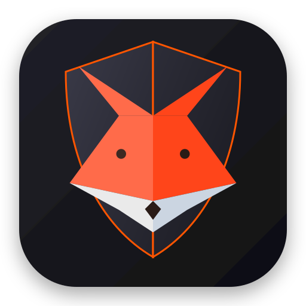

#  FoxGuard

**FoxGuard** est un système de vidéosurveillance intelligent propulsé par l'IA et développé en Rust.

---

## 🚀 Fonctionnalités Principales

* **Détection d'objets par IA** : Analyse des flux vidéo en temps réel à l'aide d'un modèle YOLOv8 (via `tract-onnx`), restreint aux classes personne / chat / chien.
* **Tracking des personnes** : Suivi de chaque personne détectée d'une frame à l'autre (association par IoU), pour ne relancer la reconnaissance faciale que lorsque c'est nécessaire (nouvelle personne, déplacement significatif, ou périodiquement).
* **Reconnaissance faciale** : Détection et alignement du visage (YuNet, recadré en 112x112) puis extraction d'une empreinte faciale (ArcFace / MobileFaceNet), comparée par similarité cosinus à une base de visages connus.
* **Capture de photo de référence depuis l'interface web** : Un bouton « Capturer » enregistre la frame webcam courante comme nouveau gabarit de référence pour un nom donné. Plusieurs captures (angles/poses différents) s'accumulent pour la même personne au lieu de se remplacer, ce qui rend la reconnaissance plus fiable (voir `known_faces/`).
* **Interface Web de Contrôle** : Panneau de contrôle moderne intégré et servi via le framework web Axum (`crates/camera/static/controller.html`).
* **Streaming Vidéo en Direct** : Diffusion par WebSockets (`/ws`) avec une optimisation de type *pass-through* (transmission directe du buffer MJPEG sans décodage/ré-encodage CPU superflu lorsque la détection est inactive).
* **Gestion des enregistrements** : Suppression manuelle depuis l'interface web (bouton par enregistrement, avec confirmation), et purge automatique des enregistrements dépassant la durée de conservation configurée (voir `[recording]`).
* **Enregistrement Vidéo** : Sauvegarde des flux en fichiers `.mjpeg` (dossier `output_record/`), activable dynamiquement depuis l'interface web, avec liste et relecture des enregistrements directement dans l'UI. Chaque frame est horodatée à l'enregistrement, pour une relecture fidèle au FPS réel de capture (qui peut varier, par exemple en basse luminosité) plutôt qu'à un débit fixe supposé.
* **Alertes par E-mail** : Notification HTML automatique (avec logo et photo de la détection en pièces jointes inline) en cas de détection, avec gestion de délai (*cooldown*) pour éviter le spam.
* **Publication MQTT (optionnelle)** : Publie un message JSON sur un broker MQTT à chaque *changement* d'état de reconnaissance d'une personne suivie (nouvelle personne inconnue, ou identification/perte d'identification), avec le nom de la caméra, l'horodatage et, si connue, le nom de la personne. Désactivée par défaut, activable via `[mqtt] enabled = true` (voir Configuration ci-dessous).
* **Overlay Graphique Natif** : Dessin de boîtes englobantes (*bounding boxes*) et de libellés textuels optimisés grâce à la police bitmap `font8x8`.

---

## 🏗️ Architecture du dépôt

FoxGuard est un **monorepo** regroupant trois composants déployés sur des
machines différentes.

| Composant | Emplacement | Tourne sur | Rôle |
| --- | --- | --- | --- |
| `foxguard-camera` | `crates/camera/` | **Raspberry Pi**, près de la caméra | Capture V4L2, détection YOLO, reconnaissance faciale, alertes, enregistrement |
| `foxguard-manager` | `crates/manager/` | **Serveur annexe** | Agrège les événements de plusieurs caméras, expose une API HTTP |
| `foxguard-protocol` | `crates/protocol/` | *(bibliothèque partagée)* | Le format des messages qui transitent sur MQTT |
| `foxguard-ui` | `ui/` | **Serveur annexe** | Interface React *(à venir, voir `ui/README.md`)* |

```
caméra (Raspberry Pi) ──MQTT──▶ broker ──▶ manager (serveur) ──HTTP──▶ ui
   crates/camera                          crates/manager              ui/
        └──────────── crates/protocol ────────────┘
```

### Pourquoi un monorepo

`foxguard-protocol` est le **contrat de fil** entre la caméra et le manager.
Dans des dépôts séparés, le manager redéclarerait les structures à la main :
le jour où un champ change, ça compilerait des deux côtés et ça casserait
silencieusement à l'exécution. Ici, rompre le contrat est une erreur de
**compilation**.

### Compatibilité entre versions déployées

Le crate partagé garantit la cohérence des *sources*, pas celle des *binaires
déployés* : caméra et manager étant mis à jour indépendamment, une caméra en
v1.2 parlera tôt ou tard à un manager en v1.4. Toute évolution de
`DetectionEvent` doit donc rester rétrocompatible — champs nouveaux toujours
optionnels, aucun champ existant renommé ni supprimé. C'est la discipline déjà
appliquée au fichier de configuration, transposée au fil MQTT.

### Compilation croisée ARM64

Le `Cargo.lock` est commun, mais **la compilation ne l'est pas** :
`cargo build -p foxguard-camera` ne construit que le sous-graphe de
dépendances de la caméra. Les dépendances propres au manager (et leur
éventuel `ring`, dont l'assembleur par architecture a déjà fait échouer la
compilation croisée sous QEMU) apparaissent dans le lock sans jamais être
compilées pour le Raspberry Pi.

### Commandes utiles

```bash
cargo test --workspace                  # toute la suite
cargo run -p foxguard-camera            # caméra (depuis la RACINE du dépôt)
cargo run -p foxguard-manager           # manager
cargo clippy --workspace --all-targets  # analyse statique
```

⚠️ La caméra se lance **depuis la racine du workspace** : les chemins de
`camera-config.toml` (modèles ONNX, dossiers de données) sont relatifs au répertoire
de travail.

---

## 📂 Structure du Projet

* **`crates/camera/src/main.rs`** : Point d'entrée de l'application — bannière de démarrage, chargement de `camera-config.toml`, initialisation de l'état partagé, lancement de la boucle caméra (tâche bloquante) et du serveur Axum.
* **`crates/camera/src/capture/`** : Capture caméra (V4L2) et pipeline de traitement, découpé par responsabilité (chaque étape a son propre fichier ; c'est `mod.rs` qui les enchaîne).
  * **`mod.rs`** : `start_camera_loop` — ouverture du périphérique V4L2, chargement des modèles et de la base de visages connus, démarrage du worker de reconnaissance, puis boucle de capture.
  * **`state.rs`** : `SharedState`, état partagé avec le serveur HTTP/WebSocket (surveillance/enregistrement actifs, jeton API, canal de diffusion, capture de référence en attente).
  * **`models.rs`** : Chargement des modèles IA (YOLO, YuNet, ArcFace) et de la base de visages connus au démarrage (`Models`).
  * **`tracking.rs`** : Suivi des personnes d'une frame à l'autre par IoU (`PersonTracker`) et reconnaissance faciale parallèle (YuNet + ArcFace, parallélisée avec Rayon). Détecte aussi, sans effet de bord, les *changements* d'état de reconnaissance de chaque personne suivie (inconnue ↔ identifiée), pour piloter la publication MQTT (voir `worker.rs` et `../mqtt.rs`).
  * **`known_faces.rs`** : Chargement (parallélisé avec Rayon) et rechargement à chaud du dossier `known_faces/`, et capture de photo de référence depuis l'UI web (rechargement en tâche de fond via `tokio::task::spawn_blocking`).
  * **`worker.rs`** : Thread d'arrière-plan (`tokio::task::spawn_blocking`) qui exécute le pipeline YOLO → tracking → reconnaissance, et publie sur MQTT (si activé) les changements d'état retournés par `tracking.rs`.
  * **`overlay.rs`** : Incrustation des bounding-box et de leur légende sur la frame vidéo.
  * **`codec.rs`** : Décodage YUYV → RGB, parallélisé avec Rayon.
  * **`recording.rs`** : Écriture des enregistrements `output_record/*.mjpeg`, avec un horodatage réel par frame pour une relecture fidèle à la vitesse de capture (au lieu d'un débit fixe supposé).
  * **`capture_loop.rs`** : Boucle principale de lecture V4L2 — incrustation des boîtes, alerte e-mail, enregistrement disque et diffusion WebSocket.
* **`crates/camera/src/api.rs`** : Routage Axum, page de contrôle (`GET /`), upgrade WebSocket authentifié par jeton (`GET /ws?token=...`), commandes JSON entrantes (`set_monitoring`, `set_detection`, `set_recording`, `capture_reference`), liste (`GET /api/recordings`), téléchargement (`GET /recordings/{filename}`) et suppression (`DELETE /api/recordings/{filename}?token=...`, seule route destructive, authentifiée par le même jeton que le WebSocket) des enregistrements (le fichier `.mjpeg` est servi tel quel ; la relecture, avec son cadencement réel, se fait côté client).
* **`crates/camera/src/vision/`** : Pipeline de vision par ordinateur, un fichier par étape.
  * **`object_detector.rs`** : `ObjectDetector` (YOLOv8), restreint aux classes personne / chat / chien.
  * **`face_detector.rs`** : `FaceDetectorYuNet`, détection et alignement de visage (recadré en 112x112).
  * **`face_recognition.rs`** : `FaceEmbedder`, empreinte ArcFace / MobileFaceNet et comparaison des identités par similarité cosinus.
  * **`model.rs`** : Chargement ONNX mutualisé par les trois modèles ci-dessus.
  * **`types.rs`** : Types partagés du pipeline (`BoundingBox`, `KnownPerson`).
* **`crates/camera/models/`** : Les 3 modèles ONNX embarqués (`yolov8n.onnx`, `face_detection_yunet_2023mar.onnx`, `arcface-mobilefacenet.onnx`).
* **`crates/camera/src/geometry.rs`** : Calcul d'intersection sur union (IoU), utilitaire partagé entre le tracking (`capture/tracking.rs`) et la détection d'objets/visages (`vision/object_detector.rs`, `vision/face_detector.rs`), pour éviter de dupliquer ce calcul.
* **`crates/camera/src/config.rs`** : Chargement et structures de `camera-config.toml` (serveur, caméra, détection, e-mail, MQTT).
* **`crates/camera/src/mail.rs`** : Construction et envoi des alertes e-mail (HTML multipart avec logo et photo de la détection).
* **`crates/camera/src/retention.rs`** : Tâche de fond qui supprime les enregistrements dépassant la durée de conservation configurée (`[recording] retention_days`), et prédicat partagé `is_recording_file` qui définit ce qui est un enregistrement pour la liste, le téléchargement, la suppression et la purge.
* **`crates/camera/src/mqtt.rs`** : Connexion à un broker MQTT et publication des événements de détection (nom de caméra, horodatage, statut connu/inconnu) à chaque changement d'état ; fonctionnalité optionnelle (voir `[mqtt]` dans `camera-config.toml`).
* **`crates/camera/src/util.rs`** : Petits utilitaires transverses (verrouillage de mutex tolérant à l'empoisonnement).
* **`crates/camera/static/controller.html`** : Interface utilisateur web — flux vidéo, interrupteurs, capture de photo de référence, liste et lecture des enregistrements (relecture calée sur l'horodatage réel des frames).
* **`crates/camera/assets/logo.svg`** : Logo FoxGuard — affiché dans ce README et embarqué dans le binaire (`include_bytes!`) pour les e-mails d'alerte.
* **`known_faces/`** : Photos de référence pour la reconnaissance faciale, nommées `<nom>_<horodatage>.jpg` (plusieurs fichiers possibles par personne).
* **`output_record/`** : Enregistrements vidéo `.mjpeg` générés par l'application.
* **`crates/manager/`** : Le manager — `config.rs` (sa configuration `manager-config.toml`), `ingest.rs` (abonnement MQTT et décodage des événements), `store.rs` (historique en mémoire, borné et **volatile**), `api.rs` (API HTTP de consultation et service du bundle de l'interface).
* **`crates/protocol/`** : `DetectionEvent` et `PersonStatus`, le contrat partagé entre la caméra et le manager.
* **`ui/`** : Interface React du manager (à venir — voir `ui/README.md`).
* **`deploy/camera/`** : `Dockerfile` de l'image Raspberry Pi.
* **`deploy/server/`** : `Dockerfile` du manager, `compose.yml` (manager + broker MQTT) et `mosquitto.conf`.

---

## 🖥️ Le manager (`crates/manager/`)

Déployé sur le serveur annexe, il s'abonne au broker MQTT sur lequel les
caméras publient et expose leur historique :

| Route | Contenu |
| --- | --- |
| `GET /api/health` | sonde de disponibilité |
| `GET /api/events` | événements récents, du plus récent au plus ancien (`?limit=`, 100 par défaut, 1000 max) |
| `GET /api/cameras` | caméras ayant émis au moins un événement encore en mémoire |
| `GET /` | bundle de l'interface React (`[server] ui_dir`) |

### Déploiement

Copier `manager-config-sample.toml` en `manager-config.toml` (gitignoré, il peut contenir
les identifiants du broker). Seul `[mqtt] broker_host` est obligatoire. Puis,
depuis la racine du dépôt :

```bash
docker compose -f deploy/server/compose.yml up -d
```

Le `compose.yml` démarre aussi un broker Mosquitto ; retirez ce service si
vous en avez déjà un sur le réseau, et renseignez son adresse dans
`broker_host`.

### Brancher les caméras dessus

Rien n'arrive tant que les caméras ne publient pas : dans le `camera-config.toml` de
CHAQUE Raspberry Pi, activez la section `[mqtt]` et pointez-la vers le broker.

```toml
[camera]
name = "salon"          # distingue les installations dans les événements

[mqtt]
enabled = true          # désactivé par défaut
broker_host = "192.168.1.50"
topic = "foxguard/detections"   # doit correspondre au `topic` du manager
```

Vérification une fois les deux côtés démarrés :

```bash
curl http://<serveur>:8090/api/events
```

> **État actuel** : squelette fonctionnel. La chaîne caméra → MQTT → manager →
> HTTP marche de bout en bout, mais l'historique est **volatile** (perdu au
> redémarrage) et l'API se limite à la consultation. La persistance et les
> notifications restent à construire.

---

## 📜 Journalisation

L'application utilise `tracing`. Le niveau se règle par la variable
d'environnement **`RUST_LOG`** :

```bash
RUST_LOG=foxguard_camera=debug cargo run -p foxguard-camera
```

Par défaut (`foxguard_camera=info,warn`), seuls les événements de cycle de vie
apparaissent : démarrage, visages de référence chargés, clients WebSocket,
enregistrements, erreurs.

Le niveau `debug` ajoute les diagnostics par visage détecté et par personne
suivie — notamment la similarité obtenue face à chaque gabarit, qui est le
moyen le plus direct de régler `face_match_threshold`. Ces messages sont
volontairement muets par défaut : ils sont émis depuis les tâches parallèles
du pipeline de vision, à raison de plusieurs par seconde.

Le manager a son propre filtre (`RUST_LOG=foxguard_manager=debug`).

---

## ⚙️ Configuration (`camera-config.toml`)

Les fichiers de configuration vivent à la **racine du dépôt**, un par
composant : `camera-config.toml` et `manager-config.toml` (modèles :
`camera-config-sample.toml` et `manager-config-sample.toml`, les deux fichiers
réels étant gitignorés car ils contiennent des identifiants).

C'est la racine et non les crates, parce que `cargo run -p <composant>` exécute
le binaire avec le répertoire de travail positionné sur la **racine du
workspace** : un fichier placé dans `crates/camera/` y serait introuvable. Un
fichier de configuration est par ailleurs une donnée de déploiement, montée ou
copiée à côté du binaire, et non du code qui voyage dans le crate.

Partez de `camera-config-sample.toml` pour créer votre propre `camera-config.toml`.

* **`[server]`** : `host`, `port`, `api_token` (jeton exigé en paramètre `?token=` pour se connecter au WebSocket).
* **`[camera]`** : `device_index` (index du périphérique V4L2, ex. `0` pour `/dev/video0`), `name` (nom de la caméra inclus dans les événements MQTT, optionnel — `"foxguard"` par défaut).
* **`[detection]`** : `enabled` (surveillance active au démarrage), chemins des 3 modèles ONNX (`model_path`, `model_detect_face_path`, `model_face_path`, tous dans `crates/camera/models/`), tailles d'entrée (`input_size` pour YOLO, `input_face_size` pour ArcFace), `confidence_threshold` (seuil de détection YOLO), `email_cooldown_secs` et `known_faces_dir` (dossier des photos de référence, `"known_faces"` par défaut, relatif au répertoire de travail — à renseigner en absolu pour un déploiement en conteneur ou en service systemd).
* **`[email]`** : `enabled`, identifiants SMTP (`smtp_server`, `smtp_user`, `smtp_password`), `from_address`, `to_address`.
* **`[recording]`** *(optionnel, section entière absente = valeurs par défaut)* : `dir` (dossier des enregistrements, `"output_record"` par défaut, relatif au répertoire de travail — à renseigner en absolu pour un déploiement en conteneur ou en service systemd), `retention_days` (durée de conservation des enregistrements, en jours — **`0` désactive entièrement la suppression automatique**) et `cleanup_interval_secs` (intervalle entre deux passages, `3600` par défaut). Un passage a aussi lieu au démarrage, pour purger ce qui a expiré pendant un arrêt prolongé. L'âge est déterminé par la date de dernière modification du fichier, jamais par son nom : un enregistrement en cours d'écriture ne peut donc pas être supprimé sous la caméra.
* **`[mqtt]`** *(optionnel, section entière absente = désactivé)* : `enabled`, `broker_host`, `broker_port` (`1883` par défaut), `username`/`password` (authentification optionnelle, pas de TLS), `topic` (`"foxguard/detections"` par défaut). Publie un message JSON à chaque changement d'état de reconnaissance, par exemple :
  ```json
  {"camera": "salon", "timestamp": "2026-09-18T15:42:07+02:00", "status": "known", "name": "jerome"}
  {"camera": "salon", "timestamp": "2026-09-18T15:45:12+02:00", "status": "unknown"}
  ```

---

## 🛠️ Compilation et Lancement

Le dépôt étant un workspace, chaque composant se lance avec `-p`. En mode
optimisé (recommandé pour les performances de l'inférence IA) :

```bash
cargo run --release -p foxguard-camera
```

⚠️ **Depuis la racine du dépôt** : les chemins de `camera-config.toml` (modèles ONNX,
dossiers de données) sont relatifs au répertoire de travail.

Le manager, lui, se lance sur le serveur annexe — pas sur le Raspberry Pi :

```bash
cargo run --release -p foxguard-manager
```

Il lit `manager-config.toml` (modèle : `manager-config-sample.toml`).

---

## 🚀 Docker — image de la caméra (Raspberry Pi)

Cette section ne concerne que `foxguard-camera`. Pour le manager, qui tourne
sur le serveur annexe, voir la section « Le manager » plus haut.

### Construire l'image Docker 

```bash
docker build -f deploy/camera/Dockerfile -t foxguard-camera:latest .
```

### Lancer le conteneur avec accès à la caméra locale (/dev/video0)

Comme l'application interagit avec la caméra webcam V4L2 locale, il faut lui passer le périphérique vidéo (--device) et persister le dossier des enregistrements (-v)

```bash
docker run -d \
  --name foxguard_app \
  --device=/dev/video0:/dev/video0 \
  -p 8080:8080 \
  -v $(pwd)/output_record:/app/output_record \
  -v $(pwd)/known_faces:/app/known_faces \
  foxguard-camera:latest
```

`known_faces/` est monté lui aussi : sans cela, les photos de référence
capturées depuis l'interface web vivent dans le système de fichiers du
conteneur et disparaissent à sa recréation.

> **⚠️ Droits des dossiers montés.** Le conteneur tourne sous un utilisateur
> non-root d'UID **10001** (voir `deploy/camera/Dockerfile`), alors qu'un
> dossier créé sur l'hôte appartient à votre utilisateur. Sans ajustement, le
> conteneur ne peut rien y écrire et l'activation de la surveillance échoue
> avec `Permission denied (os error 13)`. Préparez les dossiers une fois pour
> toutes avant le premier lancement :
>
> ```bash
> mkdir -p output_record known_faces
> sudo chown -R 10001:10001 output_record known_faces
> ```

### Construire l'image pour le raspberry

Utiliser Docker Buildx pour cibler l'architecture ARM64 (linux/arm64).

1. Activer l'émulation multi-architecture sur votre PC

```bash
docker run --privileged --rm tonistiigi/binfmt --install all
```

2. Créer un builder Docker spécifique

```bash
docker buildx create --name rpi-builder --use
docker buildx inspect --bootstrap
```

3. Builder et exporter l'image pour ARM64

Option 1 : Sans utilisation de Docker Hub ou GitHub Container Registry

1. Buildez et sauvegardez l'image dans un fichier .tar

```bash
docker buildx build --platform linux/arm64 \
  -f deploy/camera/Dockerfile \
  -t foxguard-camera:rpi4 \
  --output type=docker,dest=foxguard_rpi4.tar .
```

1. Copiez le fichier sur le Raspberry Pi :

```bash
scp foxguard_rpi4.tar foxguard@foxguard.local:/home/foxguard/
```

3. Chargez l'image sur le Raspberry Pi

```bash
# Sur le Raspberry Pi :
docker load -i foxguard_rpi4.tar
```

Option 2 : Publier sur Docker Hub

```bash
docker buildx build --platform linux/arm64 \
  -f deploy/camera/Dockerfile \
  -t jprecigout/foxguard-camera:rpi4 \
  --push .
```

sur le Raspberry Pi

```bash
docker pull jprecigout/foxguard-camera:rpi4
```

## 🛠️ Modification de la configuration du rapsberry pour activer le pilote V4L2 Legacy
Il faut configurer le Raspberry Pi pour qu'il utilise le contrôleur vidéo hérité compatible V4L2 natif. (Necessaire pour les cameras branchées avec une nappe CSI)

1. Modifier la configuration du Raspberry Pi (sur l'hôte)
   
Ouvrez le fichier de configuration de démarrage du Pi :

```bash
# Sur Raspberry Pi OS Bookworm :
sudo nano /boot/firmware/config.txt

# For more options and information see
# http://rptl.io/configtxt
# Some settings may impact device functionality. See link above for details

# Uncomment some or all of these to enable the optional hardware interfaces
#dtparam=i2c_arm=on
#dtparam=i2s=on
#dtparam=spi=on

# Enable audio (loads snd_bcm2835)
dtparam=audio=on

# Additional overlays and parameters are documented
# /boot/firmware/overlays/README

# Désactivation du pilote moderne libcamera / Unicam
# camera_auto_detect=1
camera_auto_detect=0

# Activation du pilote V4L2 hérité pour la caméra CSI
start_x=1
gpu_mem=128

# Automatically load overlays for detected DSI displays
display_auto_detect=1

# Automatically load initramfs files, if found
auto_initramfs=1

# Enable DRM VC4 V3D driver
dtoverlay=vc4-kms-v3d
max_framebuffers=2

# Don't have the firmware create an initial video= setting in cmdline.txt.
# Use the kernel's default instead.
disable_fw_kms_setup=1

# Run in 64-bit mode
arm_64bit=1

# Disable compensation for displays with overscan
disable_overscan=1

# Run as fast as firmware / board allows
arm_boost=1

[cm4]
# Enable host mode on the 2711 built-in XHCI USB controller.
# This line should be removed if the legacy DWC2 controller is required
# (e.g. for USB device mode) or if USB support is not required.
otg_mode=1

[cm5]
dtoverlay=dwc2,dr_mode=host

[all]
```
2. Charger le module et redémarrer
   
Exécutez ces commandes puis redémarrez le Pi :

```bash
echo "bcm2835-v4l2" | sudo tee /etc/modules-load.d/bcm2835-v4l2.conf
sudo reboot
```

### 📦 Lancer le conteneur sur le Raspberry Pi 4

Une fois l'image disponible sur le Raspberry Pi (via docker build local, docker load ou docker pull), exécutez le conteneur en transmettant le périphérique caméra /dev/video0

```bash
docker run -d \
  --name foxguard \
  --restart=always \
  --privileged \
  -v /dev:/dev \
  -p 8080:8080 \
  -v $(pwd)/output_record:/app/output_record \
  -v $(pwd)/known_faces:/app/known_faces \
  foxguard-camera:rpi4
```

Mêmes remarques que ci-dessus sur le montage de `known_faces/` et sur les
droits des dossiers (`sudo chown -R 10001:10001 output_record known_faces`).
---

## 🌐 Utilisation de l'Interface Web

Chaque caméra embarque **sa propre** interface, servie directement par le
Raspberry Pi. Elle reste le poste de pilotage d'une caméra donnée — et le
secours qui fonctionne encore quand le serveur annexe est en panne ou
injoignable. L'interface d'ENSEMBLE (plusieurs caméras, historique agrégé)
sera celle du manager, à venir (voir `ui/README.md`).

Ouvrez votre navigateur web et rendez-vous sur l'adresse de la caméra (par exemple : http://localhost:8080 ou http://foxguard.local:8080).

Le flux vidéo s'établit automatiquement via WebSocket.

Utilisez l'interface pour :

* Activer ou désactiver la surveillance (détection IA + enregistrement).
* Capturer une photo de référence webcam pour la reconnaissance faciale (carte « 📸 Photo de référence »), pour un nom donné ; chaque capture s'ajoute aux précédentes pour ce nom.
* Consulter, actualiser, relire et supprimer les enregistrements vidéo sauvegardés.

---

## Préparation du raspberry

### Installation de docker sur le raspberry

```bash
# Installation de docker
curl -fsSL https://get.docker.com -o get-docker.sh
sudo sh get-docker.sh

# Nettoyage 
rm get-docker.sh

# Eviter l'execution par root : Ajout de l'utilisateur actuel au groupe docker
sudo usermod -aG docker $USER

# Appliquez les changements de groupe immédiatement
newgrp docker

# Activer le démarrage automatique
sudo systemctl enable docker
sudo systemctl start docker
```

### Installation de portainer

```bash
docker volume create portainer_data
docker run -d \
  -p 9000:9000 \
  --name portainer \
  --restart=always \
  -v /var/run/docker.sock:/var/run/docker.sock \
  -v portainer_data:/data \
  portainer/portainer-ce:latest
```

Accès via l'interface web : http://foxguard.local:9000
